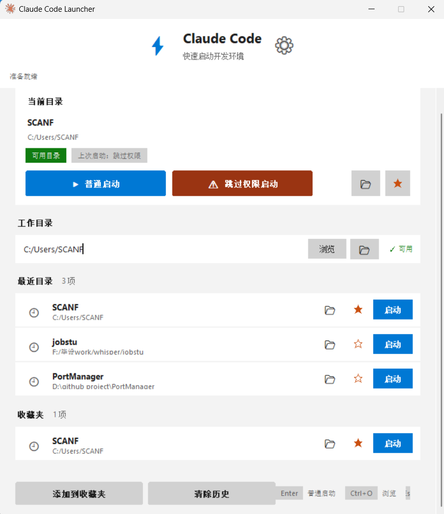

# AI Coding Launcher

> 一个专为 Windows 用户设计的多工具 AI 编程启动器，支持 Claude Code、Codex CLI 和 MiMo Code，让工作区切换和启动变得简单高效。

[](#)
[](#系统要求)
[](./LICENSE)
[](https://github.com/shuli66/claude-workspace-launcher/releases)

## 📸 界面预览



---

## 💡 为什么需要这个工具？

AI 编程工具在 Windows PowerShell 里很好用，但每次都要：
- 手动 `cd` 切换到项目目录
- 输入 `claude` / `codex` / `mimo` 等命令
- 记住不同项目的路径
- 在多个项目间频繁切换

这些重复操作会打断工作流，降低效率。

**AI Coding Launcher 让这一切变得简单**：
- ✨ 一键启动，无需命令行
- 🔀 支持多种 AI 编程工具（Claude Code / Codex CLI / MiMo Code）
- 📁 可视化管理工作区
- ⭐ 收藏常用项目
- 🎨 现代化界面，符合 Windows 使用习惯

---

## ✨ 核心功能

### 🚀 多工具支持
- **Claude Code**：普通模式 / 跳过权限模式
- **Codex CLI**：沙箱模式 / YOLO 模式
- **MiMo Code**：交互模式 / 单次执行模式
- **一键切换**：在工具栏快速切换不同 AI 编程工具
- **自动检测**：自动检测已安装的工具，未安装的显示为不可用

### 🚀 快速启动
- **多模式启动**：每个工具都有对应的启动模式
- **一键切换**：在当前工作区卡片直接启动
- **自动记忆**：记住上次使用的工具和启动模式

### 📁 工作区管理
- **路径输入**：直接输入或粘贴目录路径
- **浏览选择**：通过文件浏览器选择目录
- **实时验证**：输入时自动检查路径有效性
- **资源管理器集成**：一键在资源管理器中打开目录

### ⭐ 收藏夹系统
- **快速收藏**：点击 ★ 图标添加到收藏夹
- **即时访问**：收藏的项目显示在专属区域
- **一键启动**：直接从收藏夹启动项目

### 🕐 最近目录
- **自动记录**：自动保存最近使用的 10 个目录
- **快速回溯**：轻松返回之前的工作区
- **可视化列表**：清晰展示项目名称和完整路径

### 🎨 主题切换
- **浅色模式**：适合白天使用
- **深色模式**：适合夜间使用
- **跟随系统**：自动跟随 Windows 系统主题

### 🔧 桌面体验
- **系统托盘**：最小化到托盘，不占用任务栏
- **单实例运行**：重复启动自动激活已有窗口
- **快捷键支持**：
  - `Enter` - 普通启动
  - `Ctrl+O` - 浏览目录
  - `Esc` - 最小化到托盘
- **设置面板**：独立的设置对话框，清晰管理选项

### 🎯 界面设计
- **现代化 UI**：参考 VS Code / JetBrains 设计风格
- **卡片式布局**：信息层级清晰，一目了然
- **流畅交互**：悬停效果、状态反馈
- **可滚动内容**：支持大量收藏夹，鼠标滚轮滚动

---

## 📦 下载安装

### 方式一：下载 EXE（推荐）

**✅ 无需安装 Python，开箱即用！**

1. 前往 [Releases](https://github.com/shuli66/claude-workspace-launcher/releases/latest) 页面
2. 下载最新版本的 `ClaudeLauncher.exe`（约 31MB）
3. 下载 `install_exe.bat`（可选，用于创建桌面快捷方式）
4. 将文件放到任意目录（推荐：`C:\Program Files\ClaudeLauncher\`）
5. 双击 `install_exe.bat` 创建桌面快捷方式
6. 双击桌面快捷方式启动

**优点**：
- ✅ 无需 Python 环境
- ✅ 无需安装依赖
- ✅ 双击即用
- ✅ 适合所有用户

### 方式二：从源码运行（开发者）

**需要 Python 3.7+ 环境**

```bash
# 克隆仓库
git clone https://github.com/shuli66/claude-workspace-launcher.git
cd claude-workspace-launcher

# 安装依赖
pip install -r requirements.txt

# 运行
python claude_launcher.py
```

或使用安装脚本：
- PowerShell：右键 `install.ps1` 选择"使用 PowerShell 运行"
- 批处理：双击 `install.bat`

---

## 🎯 使用指南

### 基本使用

1. **启动程序**
   - 双击桌面快捷方式或 exe 文件

2. **选择 AI 工具**
   - 在顶部工具栏点击切换 Claude Code / Codex / MiMo
   - 已安装的工具显示为可用，未安装的显示为不可用

3. **选择工作目录**
   - 在"工作目录"输入框中输入路径
   - 或点击"浏览"按钮选择目录
   - 路径会实时验证，显示 ✓ 可用 或 ✕ 无效

4. **启动 AI 工具**
   - 在"当前目录"卡片中选择启动模式
   - 点击对应按钮即可启动

### 会话管理

1. **查看会话**
   - 程序会自动扫描当前工具的会话目录
   - 按项目/日期分组显示，包含提问内容、时间、大小

2. **恢复会话**
   - 双击会话项，直接恢复该会话
   - 或单击会话项设置路径后手动启动

3. **删除会话**
   - 点击会话项右侧的 ✕ 按钮删除

4. **文件夹操作**
   - 单击标题栏折叠/展开会话列表
   - 双击标题栏弹出模式选择对话框
   - 点击 📂 在资源管理器中打开目录

### 高级功能

#### 设置面板
点击右上角 ⚙️ 图标打开设置：
- **外观主题**：选择浅色/深色/跟随系统
- **启动选项**：设置是否启动后自动关闭启动器
- **退出程序**：点击红色"退出程序"按钮完全退出

#### 系统托盘
- 点击窗口关闭按钮或按 `Esc` 最小化到托盘
- 右键托盘图标：
  - 显示窗口
  - 设置
  - 退出程序

#### 快捷键
- `Enter` - 使用普通模式启动
- `Ctrl+O` - 打开目录浏览器
- `Esc` - 最小化到系统托盘

---

## ⚙️ 系统要求

### EXE 版本
- Windows 10 或 Windows 11
- 至少安装以下一种 AI 编程工具：
  - **Claude Code**：已安装并在 PATH 中可用
  - **Codex CLI**：已安装并在 PATH 中可用（需要 OpenAI API Key）
  - **MiMo Code**：已安装并在 PATH 中可用（需要 MiMo API Key）

### Python 版本（开发者）
- Windows 10 或 Windows 11
- Python 3.7 或更高版本
- 至少安装以上一种 AI 编程工具

**依赖库**（使用 pip 自动安装）：
- `pystray` - 系统托盘支持
- `Pillow` - 图标渲染

---

## 🔧 配置文件

启动器会在用户目录下创建配置文件：

```
%USERPROFILE%\.claude_launcher_config.json
```

配置文件示例：

```json
{
  "recent_dirs": [
    "D:\\Projects\\my-app",
    "C:\\Work\\tooling"
  ],
  "favorites": [
    "D:\\Projects\\my-app"
  ],
  "agent": "claude",
  "last_mode": "normal",
  "auto_close": true,
  "theme": "auto"
}
```

**配置项说明**：
- `recent_dirs` - 最近使用的目录列表（最多 10 个）
- `favorites` - 收藏夹列表（最多 10 个）
- `agent` - 当前选择的工具（`claude`、`codex` 或 `mimo`）
- `last_mode` - 上次使用的启动模式（取决于所选工具）
- `auto_close` - 启动后是否自动关闭启动器
- `theme` - 主题设置（`auto`、`light` 或 `dark`）

---

## 🛠️ 从源码打包

如果你想自己打包 exe：

```bash
# 安装 PyInstaller
pip install pyinstaller

# 运行打包脚本
python build.py
```

打包后的 exe 文件位于 `dist/ClaudeLauncher.exe`

---

## 📂 项目结构

```
ai-coding-launcher/
├── claude_launcher.py      # 主程序
├── claude_icon.ico         # 应用图标
├── requirements.txt        # Python 依赖
├── build.py               # 打包脚本
├── install.ps1            # PowerShell 安装脚本
├── install.bat            # 批处理安装脚本
├── install_exe.bat        # EXE 快捷方式安装脚本
├── run.bat                # 运行脚本
├── 展示.png               # 界面展示图
├── README.md              # 项目说明
├── LICENSE                # MIT 许可证
└── .gitignore             # Git 忽略文件
```

---

## ❓ 常见问题

### 快捷方式图标显示异常
- 重新运行 `install_exe.bat` 或 `install.ps1`
- 如果问题依然存在，删除旧的桌面快捷方式后重新创建
- Windows 可能会缓存快捷方式图标，重新创建通常可以解决

### 如何安装 AI 编程工具？
- **Claude Code**：`npm install -g @anthropic-ai/claude-code`
- **Codex CLI**：`npm install -g @openai/codex`（需要 OpenAI API Key）
- **MiMo Code**：`npm install -g @mimo-ai/cli`（需要 MiMo API Key 或使用免费试用）

### 启动器窗口打开但 AI 工具没有启动
- 确保所选工具的命令在 PATH 中可用
- 在 PowerShell 中运行 `claude --version` / `codex --version` / `mimo --version` 验证安装
- 检查选择的工作目录是否有效
- 对于 Codex CLI，确保 `OPENAI_API_KEY` 环境变量已设置
- 对于 MiMo Code，确保 `MIMO_API_KEY` 环境变量已设置（或使用 MiMo Auto 免费试用）

### 路径验证显示无效
- 确认输入的是真实存在的目录
- 使用"浏览"按钮避免输入错误
- 如果是从别人电脑复制的最近目录/收藏夹路径，需要改成自己电脑上真实存在的项目目录
- 从资源管理器"复制为路径"得到的带引号路径会自动清理；如果仍无效，请点击"浏览"重新选择

### 无法退出程序
- 点击右上角 ⚙️ 图标打开设置
- 点击红色"退出程序"按钮
- 或右键系统托盘图标，选择"退出程序"

### 主题切换不生效
- 打开设置面板（右上角 ⚙️）
- 选择想要的主题
- 主题会立即应用并重建界面

---

## 🗺️ 开发路线

- [x] 支持多种 AI 编程工具（Claude Code / Codex CLI / MiMo Code）
- [x] 工具选择器 UI
- [x] 会话浏览和恢复
- [x] 双击文件夹模式选择
- [x] 可折叠会话分组
- [ ] Git 分支/仓库状态显示
- [ ] 主题自定义
- [ ] 项目分组功能
- [ ] 更好的打包方案（减小文件体积）
- [ ] 多语言支持

---

## 🤝 贡献

欢迎提交 Issue 和 Pull Request！

如果你有改进 Windows 下 Claude Code 使用体验的想法，欢迎提出。

---

## 📄 许可证

本项目采用 MIT 许可证 - 详见 [LICENSE](./LICENSE) 文件

---

## ⭐ 支持项目

如果这个启动器让你在 Windows 上使用 Claude Code 更顺手，欢迎给项目点个 Star ⭐

---

## 📮 反馈与支持

- 🐛 [报告 Bug](https://github.com/shuli66/claude-workspace-launcher/issues)
- 💡 [功能建议](https://github.com/shuli66/claude-workspace-launcher/issues)
- 📖 [查看文档](https://github.com/shuli66/claude-workspace-launcher)

---

<div align="center">

**让 AI 编程工具的启动变得简单高效** 🚀

Made with ❤️ for Windows users

</div>
